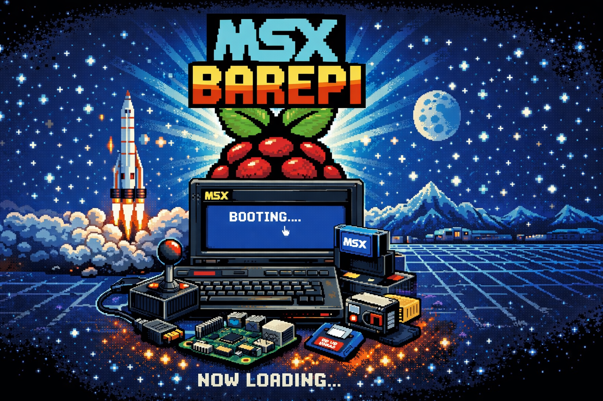

# Seja nosso patrocinador!
O projeto MSX BarePI é mantido por entusiastas dedicados que investem tempo e recursos para criar uma experiência de emulação de alta qualidade. Se você gosta do que estamos fazendo e quer apoiar o desenvolvimento contínuo, considere se tornar um patrocinador!

Ao se tornar um patrocinador, você estará contribuindo diretamente para o avanço do projeto, ajudando a financiar melhorias, correções de bugs e novas funcionalidades. Além disso, como patrocinador, você pode receber benefícios exclusivos, como acesso antecipado a builds, participação em decisões de desenvolvimento e reconhecimento especial em nossas plataformas.

Para se tornar um patrocinador, visite nossa página no Cartase: **[https://www.catarse.me/msxbarepi](https://www.catarse.me/msxbarepi)**

# O que é?
O MSX BarePI é um emulador de MSX para o Raspberry Pi, projetado para oferecer uma experiência de jogo autêntica e de alta qualidade. Ele é baseado no código do fMSX, OpenMSX e BlueMSX, um dos emuladores de MSX mais respeitados da comunidade, e foi adaptado para aproveitar ao máximo o hardware do Raspberry Pi sem a necessidade de um sistema operacional completo. O MSX BarePI é otimizado para desempenho, garantindo que os jogos rodem suavemente, mesmo em modelos mais antigos do Raspberry Pi.

# O que é um bare-metal?
Um sistema bare-metal é um ambiente de execução que roda diretamente no hardware, sem a necessidade de um sistema operacional intermediário. Isso significa que o software tem acesso direto aos recursos do hardware, como CPU, memória e periféricos, o que pode resultar em melhor desempenho e menor latência. No caso do MSX BarePI, isso permite que o emulador funcione de maneira mais eficiente, proporcionando uma experiência de jogo mais fluida e responsiva.

# Dificuldades
Desenvolver um emulador bare-metal para o Raspberry Pi apresenta vários desafios técnicos. Um dos principais desafios é a necessidade de lidar diretamente com o hardware, o que requer um conhecimento profundo da arquitetura do Raspberry Pi e do MSX. Além disso, otimizar o desempenho para garantir que os jogos rodem suavemente pode ser complexo, especialmente considerando as limitações de hardware dos modelos mais antigos do Raspberry Pi. Outro desafio é a compatibilidade com uma ampla variedade de jogos e periféricos do MSX, o que exige um esforço significativo para garantir que tudo funcione corretamente.

# Contribuição
O MSX BarePI é um projeto de código aberto, e estamos sempre em busca de colaboradores apaixonados para ajudar a melhorar o emulador. Se você tem habilidades em programação, conhecimento sobre o MSX ou experiência com desenvolvimento bare-metal, adoraríamos ter você a bordo! Você pode contribuir de várias maneiras, como corrigindo bugs, implementando novas funcionalidades, melhorando a documentação ou simplesmente testando o emulador e fornecendo feedback. Para contribuir, mande um OI! em nossa página do facebook: **[https://www.facebook.com/retrowork2](https://www.facebook.com/retrowork2)**

# Public Release 1.0.1
Estamos disponibilizando uma public release do MSX BarePI, para que todos possam experimentar e aproveitar a emulação de MSX no Raspberry Pi. Esta versão inclui melhorias de desempenho, correções de bugs e suporte para uma variedade de jogos e periféricos do MSX. Para baixar a última versão, clique **[AQUI!](https://github.com/sandersouza/msxbarepi-issues/releases/tag/v1.0.1-public#:~:text=public%2Drelease%2D1.0.1.zip)**

Essa release é exclusiva para o Raspberry Pi 3B+, e estamos trabalhando para expandir o suporte para outros modelos de Raspberry Pi no futuro. Para isso, contamos com sua contribuição na nossa campanha de financiamento coletivo no Catarse: **[https://www.catarse.me/msxbarepi](https://www.catarse.me/msxbarepi)**

# Como usar o MSX BarePI?
Para usar o MSX BarePI, siga estas etapas:
1. Baixe a última versão do MSX BarePI a partir da nossa página de releases
2. Extraia o conteúdo do arquivo baixado para um cartão SD formatado
3. Insira o cartão SD no seu Raspberry Pi 3B+
4. Conecte um teclado e ligue o Raspberry Pi
5. O MSX BarePI inicia automaticamente, e você pode jogar seus jogos favoritos de MSX!

Para acessar o `Pause Menu`, pressione a tecla `F12`.